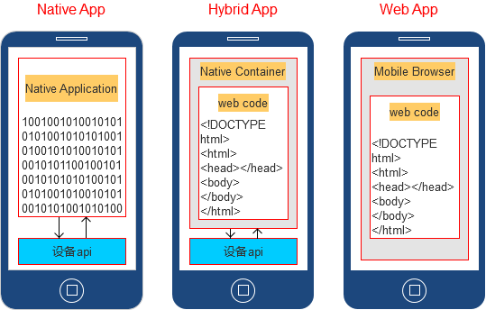
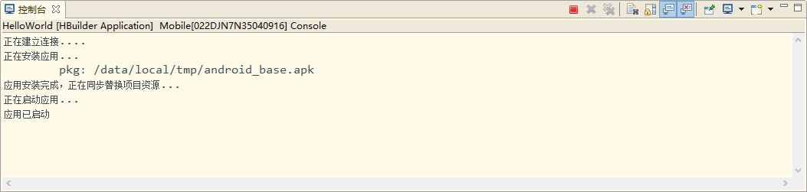

# 混合开发

## app类型



### Native App(原生App)

>特点：由专业的native开发工程师开发（IOS、Android）
* 安卓：xml + java，
* ios：xml + （Objective-C/swift）

* 优点： 
    - 运行稳定
    - 安装之后使用较为方便、用户粘度高
    - 对网络的依赖性不强
    - 流畅度高、用户体验强
    - 可以调用设备原生功能
* 缺点： 
    - 不能跨平台开发
    - 开发成本高，更新维护成本高、使用成本高。


### Web App

>特点： 由web前端工程师开发
* 技术：HTML5 + CSS3 + Javascript

* 优点： 
    - 跨平台开发，
    - 开发成本低，使用成本低，更新维护成本低（注意浏览器缓存），
    - 入口广
* 缺点： 
    - 不稳定，
    - 对网络的依赖强（H5离线缓存）
    - 流畅度较差一些，用户体验差一些
    - 不能调用设备原生功能（浏览器有安全级别限制）

* **webapp跨平台方案**：根据不同的平台访问不同的网站（window.navigator.userAgent）

### Hybrid App

>核心技术： 在native中利用webview中嵌入H5页面形成半Native半web开发模式
* 原理：底层功能API均由原生容器通过某种方式提供,然后业务逻辑由H5页面完成,最终原生容器加载H5页面,完成整个App

#### 如何判断是Native app还是Hybrid app

* 长按文字看是否被选择
* android部分手机可以开启开发调试模式-显示布局边界 ，整个手机会被线条所划分

#### 分类

* Native原生主导开发（主流）
>功能模块都是由native开发，但是某些界面、功能由嵌入的H5页面来完成
* H5主导的混合开发模式
>借助一些封装好的工具（如下）来实现应用的打包及调用设备的原生功能

    * Dcloud：Hbuilder编辑器、mui前端框架、5+Runtime
        * 官网：http://www.dcloud.io/
    * APICloud
        * 官网：https://www.apicloud.com/
    * Phonegap/Cordova

## Native原生主导开发（了解）

>原理：通过window对象作为中间层进行方法的调用，并传递数据
[《webview交互接口文档》](./img/webview交互接口文档.png)

### Native调用javascript方法

* Native调用Javascript语言，是通过UIWebView组件的`stringByEvaluatingJavaScriptFromString`方法来实现的，该方法返回js脚本的执行结果。

```swift
    // Swift
    webview.stringByEvaluatingJavaScriptFromString("Math.random()")
    // OC
    [webView stringByEvaluatingJavaScriptFromString:@"Math.random()"];

    //调用自定义方法并传入数据
    webview.setDataToJs(somedata);
    webview.setDataToJs = function(data) {
        webview.stringByEvaluatingJavaScriptFromString("JSBridge.trigger(event, data)");
    }
```

>PS:只能调用js中的全局方法，在实际项目开发过程中建议只暴露一个全局对象(如：JSBridge)来规避冲突风险


### Javascript调用Native方法

#### 使用UIWebView

Javascript调用Native，并没有现成的API可以直接拿来用，而是需要间接地通过一些方法来实现。UIWebView有个特性：在UIWebView内js发起的所有网络请求，都可以通过delegate函数在Native层得到通知

* js发起一个网络请求的方式
    1. 通过localtion.href（限制：只能发一次）
    2. 通过iframe方式

```js
    var url = 'jsbridge://doAction?title=分享标题&desc=分享描述&link=http://www.baidu.com';
    var iframe = document.createElement('iframe');
    iframe.style.width = '1px';
    iframe.style.height = '1px';
    iframe.style.display = 'none';
    iframe.src = url;
    document.body.appendChild(iframe);
    setTimeout(function() {
        iframe.remove();
    }, 100);
```
#### 使用JavaScriptCore

* Native在window对象定义好给JS需要调用的方法（如：share方法）
* 则可以在UIWebView加载url完成后，在其代理方法中添加要调用的share方法，这样的话web页面中就可以直接使用到这个方法
```js
    function secondClick() {
        share('分享的标题','分享的内容','图片地址');
    }
    //...
    <button type="button" onclick="secondClick()">Click Me!</button>
```

>PS：android 调用 js 和oc、swift类似

参考：

* http://www.jianshu.com/p/d19689e0ed83
* https://juejin.im/post/599a58f6f265da247b4e756b


## H5主导的混合开发

基于HTML、JS、CSS编写的Hybrid App，这种App可以通过扩展的JS API任意调用手机的原生能力，实现与原生App同样强大的功能和性能

### Dcloud

>官网：http://www.dcloud.io/

#### Hbuilder编辑器

* Builder内置HTML5+ APP开发环境
* 集成真机运行环境，方便开发后即时在真机上查看运行效果
* 集成应用云端打包系统，不用部署xcode和Android sdk就可以打包应用

#### mui前端框架

#### 5+Runtime

>增强版的手机浏览器引擎，让HTML5应用达到原生水平

* 调用HTML5+ API
    - HTML5Plus规范（跨平台）：常用的扩展能力，比如二维码、语音输入，都封装到了规范中，同时实现了Android和iOS的解析引擎，使得开发者的代码编写一次，可跨平台运行。
    - Native.js是另一项创新技术。手机OS的原生API有四十多万，大量的API无法被HTML5使用。Native.js把几十万原生API映射成了js对象，通过js可以直接调ios和android的原生API。这部分就不再跨平台，写法分别是plus.ios和plus.android，比如调ios game center，或在android手机桌面创建快捷方式，这些都是平台专有的api。
    ```js
        //将一个原生对象android.content.Intent映射为js对象obj，然后在js里操作obj对象的方法属性就可以了。
        var obj= plus.android.import("android.content.Intent");
    ```

* 真机运行 run in device
>将iOS或Android设备连接到电脑，这时HBuilder会自动检测连接到电脑上的设备，通过菜单栏中的“运行”菜，“运行到手机或模拟器” -> 选择检测到的手机

    * 启动真机运行后，在控制台中显示以下信息：

    


#### 发行打包

完成应用页面的编辑后，需要正式打包为原生的apk或ipa安装包，HBuilder提供的打包有**云打包**和**本地打包**两种。

云打包的特点是DCloud官方配置好了原生的打包环境，可以把HTML等文件编译为原生安装包。

1. 对于不熟悉原生开发的前端工程师，云打包大幅降低了他们的使用门槛。
2. 对于没有mac电脑的开发者，他们也可以通过云打包直接打出iOS的ipa包。

步骤：通过菜单栏中的“发行”->“App打包”，打开“App云端打包”对话框提交。
>注意只有移动App项目才可以打包

## 参考

* Manifest.json配置说明文档： http://ask.dcloud.net.cn/article/94