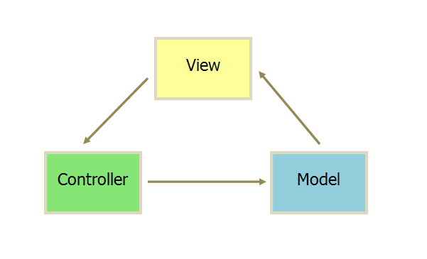
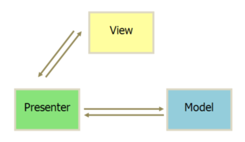
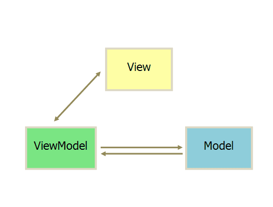
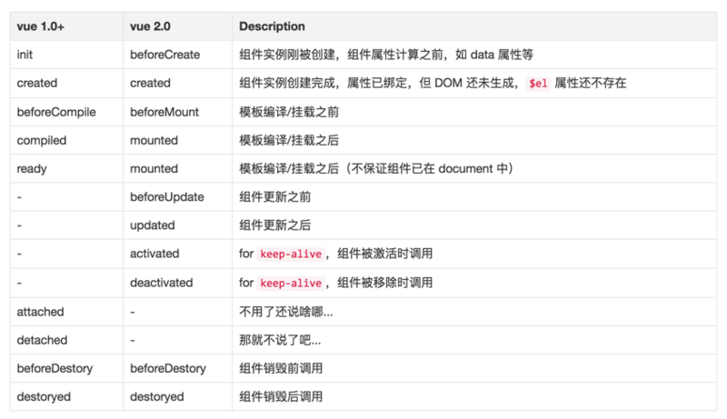

[TOC]

# VUE
> 读音：[vjuː]，view

## 了解VUE
这两年国内最火的前端框架当属Vue.js了，很多使用过vue的程序员这样评价它，“vue.js兼具angular.js和react.js的优点，并剔除了它们的缺点”。授予了这么高的评价的vue.js，也是开源世界华人的骄傲，因为它的作者是位中国人–尤雨溪（Evan You）。 

Vue.js 是一个基于MVVM模式的一套渐进式框架。它是以数据驱动和组件化的思想构建的，采用自底向上增量开发的设计。相比于Angular.js，Vue.js提供了更加简洁、更易于理解的API，使得我们能够快速地上手并使用Vue.js

### 前端框架历史
* jquery阶段（2006-2013）
    - 特点：节点操作简单易用，浏览器兼容
* angular阶段（2009-2014）
    - 特点：MVC模式，双向数据绑定，依赖注入
* react阶段（2013）
    - 特点：virtual DOM，性能上碾轧angularJS
* vue阶段（2014-2016）
    - 特点：综合angular与react的优点，MVVM模式，是一款高性能高效率的框架

### 架构模式
复杂的软件必须有清晰合理的架构，更容易开发、维护和测试

* MVC
    > MVC模式的意思是，软件可以分成三个部分。

    * 模型（Model）：数据处理
    * 视图（View）：数据展示
    * 控制器（Controller）：业务逻辑处理（M和V之间的连接器）

    

    1. View 传送指令到 Controller（用户发送指令）
    3. Controller 完成业务逻辑后，要求 Model 改变状态
    2. Model 将新的数据发送到 View，用户得到反馈


    * 缺点：依赖复杂
        * View 依赖Controller和Model
        * Controller依赖View和Model

* MVP
    > MVP 架构模式是 MVC的改良模式（改进Controller， 把Model和View完全隔离开）

    * Model
    * View
    * Presenter 可以理解为松散的控制器，其中包含了视图的 UI 业务逻辑，所有从视图发出的事件，都会通过代理给 Presenter 进行处理；同时，Presenter 也通过视图暴露的接口与其进行通信。

    

* MVVM
    > 由MVP模式演变而来

    * Model
    * View
    * ViewModel  类似与MVP中的Presenter，唯一的区别是，它采用双向绑定：View的变动，自动反映在 ViewModel，反之亦然

    

    - 核心思想：关注Model的变化，让MVVM框架利用自己的机制去自动更新DOM，从而把开发者从操作DOM的繁琐中解脱出来！


## 安装和引入
>* 开发环境：development
* 生产环境：production

* script标签
* cdn
```html
    <script src="https://cdn.jsdelivr.net/npm/vue@2.5.17/dist/vue.js"></script>
```
* npm
>能很好和webpack等打包工具配合使用
* vue-cli脚手架
>快速的搭建基于webpack的开发环境


## 使用

## 实例化
```javascript
    var data = { name: 'laoxie' }
    var vm = new Vue({
      el: '# app',
      data: data
    });

```
### 常用配置选项
* 关于DOM节点
    * el（类型：Selector|Element)
        > Vue实例的挂载目标（实例中所有的属性/方法可直接在el中直接使用），挂载元素会被 Vue 生成的 DOM 替换
    * template（类型：String）
        > 模板，如果不指定则以ele所在元素作为模板
        * Selector：提取内容到template标签，并指定选择器
    - render（类型：Function）
        > template的代替方案，允许你发挥 JavaScript 最大的编程能力。该渲染函数接收一个 createElement(tagName,props,children) 方法作为第一个参数用来创建 VNode
        * 优先级：render > template > el.outerHTML

        ```js
            new Vue({
                //...
                el:'#app',
                template:`<div>{{username}}</div>`,
                render:createElement=>{
                    return createElement('h1',{title:'标题',class:'title'},'文章标题')
                }
            })
        ```
* 关于数据
    - data（类型：Object|Function)
        > Vue实例化时，它将data中所有的属性添加到**响应式系统**中，当这些数据改变时，视图会进行重渲染

    - computed（类型：Object)
        > 对于需要复杂逻辑或运算才能得到的值，应当使用计算属性
    - methods（类型：Object)
        >一般用于编写公共方法、事件处理函数等，方法中的this指向实例，所以不应该使用箭头函数来定义 method 函数
    - watch（Object）
        >监听属性（Function），监听的值被修改时会自动调用函数，当需要在数据变化时执行异步或开销较大的操作时，这个方式是最有用的
        ```js
            watch: {
                username: function (val, oldVal) {
                    console.log('new: %s, old: %s', val, oldVal)
                }
            }
        ```

## 实例属性&方法
> Vue实例化时，会遍历data/computed/methods中所有属性/方法，并写入Vue的实例

### 响应式属性
> 遍历data中所有属性，通过Object.defineProperty()方法把它们设置为存储器属性（getter & setter），并写入Vue实例

* 存储器属性（getter & setter）
* **双向数据绑定原理**
    * View -> Model
    * Model -> View
* 设置响应式属性
    * 设置初始化数据
    * Vue.set(target,key,val) 向**响应式系统**中的对象添加属性并自动渲染视图
        > 注意：target对象不能是 Vue 实例，或者 Vue 实例的根数据对象
    * 数组变异方法

### 内置属性
> 除了数据属性，Vue 实例还提供了一些有用的实例属性与方法。它们都有前缀 $，以便与用户定义的属性区分开来

- $data: 同 data
- $el: 同 el节点
- $parent
- $children
- $root

### 内置方法

* 数据data
    - $watch()：监听数据变化，同watch配置选项
    - $set()：Vue.set()的别名
* 事件event
    - $on()     ：监听当前实例上的自定义事件
    - $off()    ：移除自定义事件监听器
    - $emit()   ：触发当前实例上的事件
* 生命周期函数
    * $mount()  ：
        > 如果实例化时未配置 el 选项，则它处于“未挂载”状态，没有关联的 DOM 元素。可以使用 vm.$mount() 手动地挂载
    * $destroy()
        > 完全销毁一个实例。清理它与其它实例的连接，解绑它的全部指令及事件监听器。触发 beforeDestroy 和 destroyed 的钩子
    * $nextTick(callback)
        > 同Vue.nextTick()，将回调延迟到下次 DOM 更新循环之后执行
    * $forceUpdate() 强制刷新组件

```javascript
    vm.$watch('name', function (newValue, oldValue) {
        // 这个回调将在 `vm.name` 改变后调用
    });
```


## 生命周期
<!--  -->


### 生命周期函数（钩子函数）
>在某个时刻被自动执行的函数，this指向实例，以下为1.x与2.x钩子函数对照表：



* beforeCreate()
    * 应用：可以在这加个loading事件 
* created()
    * 应用：在这结束loading，还做一些初始化，实现函数自执行
* beforeMount()
    * 应用：在这发起ajax请求，拿回数据，配合路由钩子做一些事情
* mounted(): 数据挂载成功
    * 应用：节点操作
* beforeUpdate()
* updated()
* beforeDestroy()
* destroyed()
    > 执行destroy()后，不会改变已生成的DOM节点，但后续就不再受vue控制了

    * 应用：清除定时器、延迟器、取消ajax请求等

## 指令directive
指令是带有 v-* 前缀的特殊属性，格式：`v-指令名:参数.修饰符`

### 内置指令

#### 数据绑定
* 单向数据绑定
    * {{}}：插值表达式
        > 差值表达式中应当放置一些简单的运算（data中的数据、函数执行、三元运算等），对于任何复杂逻辑，你都应当使用计算属性操作完成后再写入插值表达式
    * v-text：显示文本
    * v-html：显示html内容
    * v-bind：可绑定任意属性
        ```html
            
            <!-- 简写  -->
            
        ```
        - 对style与class的绑定
            > 在将 v-bind 用于 class 和 style 时，Vue做了专门的增强。表达式结果的类型除了字符串之外，还可以是对象或数组
       
        ```html
            <div class="static"
                 v-bind:class="{ active: isActive, 'text-danger': hasError }"
                 v-bind:style="{ color: activeColor, fontSize: fontSize + 'px' }">
            </div>
            <script>
                new Vue({
                    data: {
                        isActive: true,
                        hasError: false,
                        activeColor: 'red',
                        fontSize: 30
                    }
                })
            </script>
            <!-- 最终结果：<div class="static active" style="color:red;font-size:30px"></div> -->
        ```
* 列表渲染
    * v-for
        > 可遍历Array | Object | number | string | Iterable

        * 遍历数组
        ```html
            <li v-for = "(value, index) in arr">{{value}}</li>
        ```
        * 遍历对象
        ```html
            <tr v-for = "(value, key, index) in obj">
                <td>{{index+1}}</td>
                <td>{{key}}-{{value}}</td>
            </tr>
        ```
    * key：Vue 识别DOM节点的一个通用机制
        > Vue对相同的元素进行展示排序等操作时，遵循“就地复用”原则，指定key属性后，意为去掉“就地复用”特性（建议尽可能在使用 v-for 时提供 key）
* v-model双向数据绑定
    > v-model一般用于表单元素，会忽略所有表单元素的 value、checked、selected 特性的初始值而总是将 Vue 实例的数据作为数据来源

    - 单行文本框text
        > v-model值绑定到value属性
    - 多行文本框textarea
        > v-model值绑定到value属性
    - 单选框radio
        > v-model值绑定到value属性
    - 复选框checkbox
        + 初始值为数组，与value属性绑定
        + 初始值为其他，与checked属性绑定(true,false)
            + true-value：设置选中时的值
            + false-value：设置补选中时的值
    - 选择框select
        > v-model值绑定到value属性，无value属性则与内容绑定
    - 修饰符
        - lazy
        - number
        - trim

#### 显示隐藏
* v-show
* v-if
    - v-else
    - v-else-if

#### 事件绑定
>格式：v-on:事件类型.修饰符="事件处理函数"

* v-on
* 事件修饰符
    - stop
    - prevent
    - capture
    - self  只当在 event.target 是当前元素自身时触发处理函数
    - once 事件将只会触发一次
    - 按键修饰符
        * 直接使用键码来作为按键修饰符
        ```html
            <!-- 只有在 `keyCode` 是 13 时调用 `vm.submit()` -->
            <input v-on:keyup.13="submit">
        ```
        * 使用别名作为按键修饰符
            + left,up,right,down
            + enter
            + tab
            + esc
            + space


### 自定义指令
* 全局指令
    * 格式：Vue.directive(name,option)
    * 参数
        * name：指令名字，使用格式：v-name
        * option
            * Object：放钩子函数
            * Function：默认为bind和update的钩子函数
* 局部指令
    格式：directives: {}
* 钩子函数（了解）
    * bind：初始化时执行（默认）
    * inserted：元素插入页面时执行
    * update：所在模板更新时执行
    * componentUpdated：所在模板完成一次更新周期时调用
    * unbind：指令与元素解绑时执行
    * 参数
        * el    指令所绑定的元素，可以用来直接操作 DOM
        * binding   一个对象，包含以下案例中的属性
        * vnode
        * oldVnode
        >仅在update 和 componentUpdated 钩子中可用

```javascript
   // 使用指令：v-laoxie
    Vue.directive('laoxie', {
      bind: function (el, binding, vnode) {

        //binding参数如下
        el.innerHTML =
          'name: '       + JSON.stringify(binding.name) + '<br>' + //指令名
          'value: '      + JSON.stringify(binding.value) + '<br>' + //指令值
          'expression: ' + JSON.stringify(binding.expression) + '<br>' + //字符串形式的指令表达式
          'arg: '        + JSON.stringify(binding.arg) + '<br>' + //指令参数，
          'modifiers: '  + JSON.stringify(binding.modifiers) + '<br>' + //指令修饰符
      }
    });
```


## 过滤器
Vue允许你自定义过滤器，可被用于一些常见的文本格式化。
过滤器可以用在两个地方：双花括号插值和 v-bind 
```html
    <!-- 在双花括号中 -->
    {{ message | capitalize }}

    <!-- 在 `v-bind` 中 -->
    <div v-bind:id="rawId | formatId"></div>
```

### 全局过滤器
>格式：Vue.filter(name,definition)

### 局部过滤器
>格式:filters属性

```javascript
    // 首字母大写
    Vue.filter('capitalize', function (value) {
      if (!value) return ''
      value = value.toString()
      return value.charAt(0).toUpperCase() + value.slice(1)
    })
```

---
【案例】

* tab标签切换
* 表格操作
* 编写自动获得焦点指令
* 首字母大写过滤器

【练习】

* 编写返回顶部指令
* 全选反选案例
* 商品列表排序
* 日期格式化过滤器
