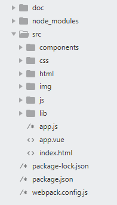

[TOC]

# 模块系统

## 前言

在很多 Vue 项目开发中，常规做法：
1. 定义组件 
2. 使用组件（如下代码）

```javascript
    //定义全局组件
    Vue.component('my-component',{});

    // 在模板中使用组件
    new Vue({
        el: '#app '
        template:'<div><my-component></my-component></div>'
    });
```

> 这种方式在很多中小规模的项目中运作的很好，但在复杂的项目中，就有以下缺点:

* 缺点
    * **全局定义 (Global definitions)** 强制要求每个 component 中的命名不得重复
    * **字符串模板 (String templates)** 缺乏语法高亮，在 HTML 有多行的时候，需要用到丑陋的 \
    * **不支持 CSS (No CSS support)** 意味着当 HTML 和 JavaScript 组件化时，CSS 明显被遗漏
    * **没有构建步骤 (No build step)** 限制只能使用 HTML 和 ES5 JavaScript, 而不能使用预处理器，如 Pug (formerly Jade) 和 Babel

## vue单文件组件
> Vue**单文件组件**(扩展名为 .vue)，由于浏览器不支持.vue文件，和ES6的模块化(import,export)开发,必须利用babel和webpack工具来辅助实现编译成浏览器支持的格式

* vue单文件优点
    - 完整语法高亮
    - CommonJS 模块
    - 组件作用域的 CSS


### vue单文件组件开发流程
> webpack打包

#### 定义目录



* 安装必要模块
```json
    "devDependencies": {
        "html-webpack-plugin": "^3.2.0",
        "vue": "^2.5.17",
        "vue-loader": "^15.4.2",
        "vue-template-compiler": "^2.5.17",
        "webpack": "^4.18.0",
        "webpack-cli": "^3.2.3"
      }
```

* 设置webpack配置文件（webpack.config.js）
```javascript
    const path = require('path');
    const HtmlWebpackPlugin = require('html-webpack-plugin');
    const { VueLoaderPlugin } = require('vue-loader');

    // 导出配置模块
    module.exports = {
        // 设置入口文件
        entry:'./src/app.js',

        // 输出配置
        output:{
            path:path.resolve(__dirname,'./dist'),
            filename:'js/[name]-bundle.js'
        },
        module:{
            rules:[
                // 匹配.vue单文件模板，并利用vue-loader、vue-template-compiler进行编译
                {
                    test:/\.vue$/,
                    loader:['vue-loader']
                }
            ]
        },
        plugins:[
            // 依据html模板生成一个自动引用你打包后的文件（js或css）的新的html页面
            new HtmlWebpackPlugin({
                template:'./src/index.html'
            }),

            // Vue-loader 15.x之后的版本都需要伴随 VueLoaderPlugin， 否则报错
		    new VueLoaderPlugin(),
        ]
    }
```

* 应用入口文件（app.js）
```javascript
    //ES6 引入其他模块（可以是js,css,vue单文件等）
    import Vue from 'vue';
    import App from './app.vue';

    new Vue({
        el:'#app',

        // render 函数若存在，则忽略 template 或 el 元素中的内容
        render(create){
            return create(App);
        }
    });
```

* 单文件组件（app.vue）
```html
    <template>
        <div class="container">
            <h1>Hello {{name}}</h1>
            <button class="btn btn-success">点击进入</button>
        </div>
    </template>

    <script>
        // 导出当前组件配置选项
        export default{
            data(){
                return{
                    name:'Vue单文件组件'
                }
            }
        }
    </script>
    
    <!-- 设置具有组件作用域的样式 -->
    <style scoped>
        h1{color:#58bc58;}
    </style>
```


### ES Module
历史上，JavaScript一直没有模块体系（module），无法将一个大程序拆分成互相依赖的小文件，再用简单的方法拼装起来。其他语言都有这项功能，唯独javascript没有，在这之前我们都是借助第三方工具（request.js等）来实现模块化开发，直到ES6 module的出现，成为浏览器和服务器通用的模块解决方案，完全可以取代 CommonJS 和 AMD 规范

#### 基本特点
* 每一个模块只加载一次， 并执行一次，再次加载同一文件，直接从内存中读取；
* 每一个模块内声明的变量都是局部变量， 不会污染全局作用域；
* 通过export导出模块，通过import导入模块
* ES6模块只支持静态导入和导出，只可以在模块的最外层作用域使用import和export
，

#### export
>export命令用于规定模块的对外接口，只允许导出最外层函数、类以及var、let或const声明的变量，可多次export，export出去后自动成为**模块对象的属性**。
* PS: export后只能跟function、class、var、let、const、default、{}

* 基本用法
```javascript
    //base.js
    var myName = 'laoxie';
    var age = 1995;

    // 多次export
    export {myName};
    export let gender="男";
    export function show(){ 
        console.log(666); 
    }
```

* as
通常情况下，export输出的变量就是本来的名字，但是可以使用as关键字重命名
```javascript
    function show(){
        console.log('my name is show');
    }
    
    export {show as showName};
```

* default
为模块指定默认输出，这样就可以在使用 import 令的时候，不必知道所要加载的变量名或函数名
```javascript
    export default {
        data:{
            path:'/src/'
        }
    }
```

* `*` 作为中转模块导出，把某个模块的所有相属性/方法导出
```javascript
    export * from './md.js';
```

#### import
>import命令用于导入其他模块提供的功能

* 基本用法
```javascript
    //从模块对象中导入属性为default的值，并赋值给变量res，无则得到undefined
    import res from './base.js';

    //导入模块对象中属性为myName的值并赋值给变量myName
    import {myName} from './base.js';

    console.log(myName,res);
```

* as 修改变量名
```javascript
    //导入模块对象中属性为myName的值并赋值给变量username
    import {myName as username} from './base.js';
```

* `*` 导入整个模块对象
```javascript
    //导入整个模块对象，并赋值给myModule变量
    import * as myModule from './base.js';

```
