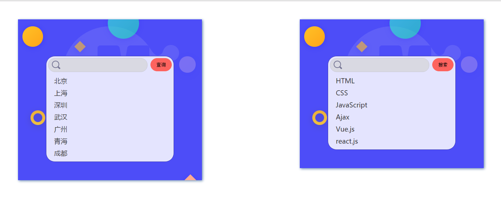
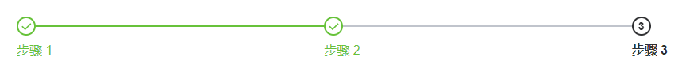

[TOC]

# VUE

## 组件Component
组件是 Vue最强大的功能之一，组件可以扩展 HTML 元素，封装可重用的代码。组件系统让我们可以用独立可复用的小组件来构建大型应用，几乎任意类型的应用的界面都可以抽象为一个组件树


### 优点
* 代码复用
* 便于维护

### 组件要求

* data必须为Function类型
* 每个组件必须只有一个根元素,否则报错
* 注册时组件名可以是kebab-case或PascalCase，但在html页面上使用时，必须写成遵循W3C 规范中的自定义组件名 (字母全小写且必须包含一个连字符)

### 组件注册
>组件是可复用的 Vue 实例，带有一个名字，所以它们与 new Vue 接收相同的选项，例如 data、computed、watch、methods 以及生命周期钩子等（el选项除外）


#### 全局组件
使用Vue.component()创建的为全局组件，所有的Vue实例都可以使用
```javascript
    Vue.component('my-component', {
      // ... options ...
      template:'<p>我是全局组件</p>'
    })
```
#### 局部组件
在某个Vue实例中通过components属性注册的组件为局部组件，只有当前实例能使用
```javascript
    
    var Child = {
        data(){
            return {
                name:'我是局部组件'
            }
        },
        template: '<h1>hello, {{name}}</h1>'
    }
     
    // 创建根实例
    new Vue({
      el: '#app',
      components: {
        Child
      }
    });
```
#### 使用组件
>使用组件时，组件template中的内容会替换调组件所在位置

```html
    <div id="app">
      <my-component></my-component>
      <child></child>
    </div>
```

>注意：由于Vue 只有在浏览器解析和标准化 HTML 后才能获取模板内容，所以把组件嵌套在某些特定的元素（如table,ul,ol,select等）上时，会导致解析错误

```html
  <!-- table为已经存在html页面上的元素 -->
  <table>
    <my-row></my-row>
  </table>
```
```javascript
  Vue.component('my-row',{
    template:'<tr><td>test</td></tr>'
  });
```
>以上解析的结果为，tr被解析到了table外面，解决方式也很简单，利用特殊的is属性实现

```html
  <table>
    <tr is="my-row"></tr>
  </table>
```

### 组件通讯

#### 父组件->子组件： props
组件实例的作用域是孤立的。这意味着不能（也不应该）在子组件的模板内直接引用父组件的数据。要让子组件使用父组件的数据，需要通过子组件的props选项

* props声明属性：声明的属性会自动成为组件实例的属性（可通过this.xx访问）
>prop传递是单向的，当父组件的属性变化时，将传导给子组件，但是不会反过来


```html
    <blog-post mytitle="静态数据"></blog-post>
```
```javascript
    Vue.component('blog-post', {
      props: ['mytitle'],
      template: '<h3>{{ mytitle }}</h3>'
    })
```

```html
   <blog-post :msg="message"></blog-post>

    <!-- 传入一个对象 -->
   <blog-post v-bind:author="{ name: 'laoxie', age:18 }"></blog-post>
```
```javascript
    Vue.component('blog-post', {
      props: ['msg','author'],
      template: '<h3>{{ msg }}</h3>'
    });

    let vm = new Vue({
      data:{
        message:'hello laoxie'
      }
    })
```

* 非prop属性：不通过props声明的属性
>此类属性会自动成为组件根节点的属性

* prop数据验证
>对传入的prop属性进行校验，如：数据类型、必填、默认值等
```javascript
  Vue.component('my-component', {
    props: {
      // 基础的类型检查 (`null` 匹配任何类型)
      propA: Number,
      // 多个可能的类型
      propB: [String, Number],
      // 必填的字符串
      propC: {
        type: String,
        required: true
      },
      // 带有默认值的数字，无prop属性传入时，默认得到100
      propD: {
        type: Number,
        default: 100
      },
      // 带有默认值的对象
      propE: {
        type: Object,
        // 对象或数组默认值必须从一个工厂函数获取
        default: function () {
          return { message: 'hello' }
        }
      },
      // 自定义验证函数
      myscore: {
        validator: function (value) {
          // 这个值必须大于等于60，否则报错
          return val>=60
        }
      }
    }
  })
```

#### 子组件->父组件： 自定义事件 + $emit()
> PS：Vue遵循**单向数据流**原则，不允许在子组件中直接修改props传入的父组件数据（谁的数据谁修改），可以通过自定义事件系统，利用$emit()方法触发父组件函数来达到修改的效果

* 方式一（推荐）：
  1. 子组件上自定义事件（如:show），并使用父组件的事件处理函数（handler）
  >`<mycom v-on:show="handler" />`
  2. 子组件内部触发自定义事件并传递参数
  >this.$emit('show',100) 会触发父组件的事件处理函数handler，从而实现数据修改

* 方式二：
  1. 可以利用v-bind:xx.sync修饰符（如下color属性）
  2. 子组件调用`this.$emit('update:xx',val)`触发更新

```html
  <div id="app">
    <p :style="{fontSize:fontSize+'px'}">字体大小：{{fontSize}}</p>

    <btn-change :font-size="fontSize" @bigger="updateFontSize" :color.sync="color"></btn-change>
  </div>

  <template id="myButton">
    <button @click="changeSize">改变字体大小</button>
    <button @click="changeColor">改变字体颜色</button>
  </template>

  <script>
    new Vue({
      el:'#app',
      data:{
          fontSize:16,
          color:'red'
      },
      components:{
        btnChange:{
          props:['fontSize'],
          template:'#myButton',
          methods:{
            changeSize(){
              this.initFontSize++;

              // 手动触发自定义事件并传递修改后的值
              this.$emit('bigger',this.fontSize+1);
            },
            changeColor(){
              this.$emit('update:color','#58bc58');
            }
          }
        }
      },
      methods:{
        updateFontSize(val){
          // 触发自定义事件的事件处理函数，并修改字体大小
          this.fontSize = val;
        }
      }
    })
  </script>
```

#### 兄弟组件通信
* 组件A -> 父组件 -> 组件B
>组件A与组件B具有共同父级

#### 无关联组件间传参
>利用一个Vue实例作为中间桥梁实现传参（如：组件A与组件B无任何联系）

- 接收方（组件B）：自定义事件
- 传输方（组件A）：$emit()

```javascript
    // 定义中间桥梁bus
    let bus = new Vue();

    //组件A
    let comA = {
        data(){
            return {
              msg:'I am A'
            }
        },
        template:`<div>
            <p>{{msg}}</p>
            <button @click="send">传数据到B组件</button>
        </div>`,
        methods:{
            send(){
                bus.$emit('data',this.msg);
            }
        }
    }

    // 组件B
    let comB = {
        data:()=>({
            msg:'I am B'
        }),
        mounted(){
            bus.$on('data',val=>this.msg = val)
        },
        template:`<div><p>{{this.msg}}</p></div>`
    }

    // 创建实例，并注册子组件
    new Vue({
        el:'#app',
        components:{
            comA,
            comB
        }
    });
```

### 插槽内容

#### 利用组件内容进行通讯（父->子）
* 默认插槽default
>在组件模板中利用内置组件`<slot></slot>`来承载组件内容,否则它的内容都会被忽略（被模板内容覆盖）

```html
  <!-- 使用指令 -->
  <nav-link url="/home">首页</nav-link>

  <!-- 定义指令 -->
  <script>
    Vue.component('nav-link',{
      props:['url']
      //以下写法，组件内容“首页”，会被template的内容覆盖掉，
      //最终解析为：<a href="/home"><span>Home</span></a>
      //template:`<a :href="url"><span>Home</span></a>`

      // 可以用<slot></slot>保留内容和设置默认值
      // 最终解析为：<a href="/home">首页<span>Home</span></a>
      template:`<a :href="url"><slot></slot><span>Home</span></a>`
    });
  </script>
```

* 具名插槽：
  * 模板内容：给`<slot/>`组件命名（设置name属性）
  * 组件内容：设置slot属性，实现内容精准显示到模板具体位置
  > Vue2.6+已经废除slot属性，改成`v-slot:name`（只能用在template元素上）

```html
  <!-- 组件模板内容 -->
  <template id="myTest">
    <div>
      <slot name="header">这是拥有命名的slot的默认内容</slot>
      <slot>这是拥有命名的slot的默认内容</slot>
      <slot name="footer">这是拥有命名的slot的默认内容</slot>
    </div>
  </template>

  <!-- 使用组件 -->
  <my-component>
    <span slot="header">这里的内容显示到name为header的插槽</span>
    <span>这里的内容显示到默认插槽</span>
    <span slot="footer">这里的内容显示到name为footer的插槽</span>
  </my-component>

  <!-- Vue2.6+用法 -->
  <my-component>
    <span v-slot:header>这里的内容显示到name为header的插槽</span>
    <span>这里的内容显示到默认插槽</span>
    <span v-slot:footer>这里的内容显示到name为footer的插槽</span>
  </my-component>
```

#### 作用域插槽（子->父）
> Vue编译规则：父组件模板的所有东西都会在父级作用域内编译；子组件模板的所有东西都会在子级作用域内编译

> 利用作用域插槽(slot-scope)实现把组件模板template中的数据传到组件内容中处理，实现特殊定制（PS：Vue2.6+已废除该属性，改为`v-slot:name`格式，简写：#name）

```html
  <!-- 组件模板 -->
  <div class="box">
    <slot :msg="msg" :username="username">{{username}}，{{msg}}</slot>
    <slot name="footer" title="播放器" :player="player">{{player}}</slot>
  </div>

  <!-- 组件内容 -->
  <mynav>
    <!-- props为传过来的数据组成的对象 -->
    <div slot-scope="props">{{props.msg}}，{{props.username}}</div>

    <!-- Vue2.6+用法 -->
    <div v-slot:default="props">{{props.msg}}，{{props.username}}</div>
    <div v-slot:footer="foot">{{foot.title}}，{{foot.player}}</div>
  </mynav>
```

### 内置组件
* `<component>` 动态组件
    * is：指定渲染的组件

```html
  <component v-bind:is="currentTabComponent"></component>
```
* `<keep-alive>` 缓存组件
>把切换出去的组件保留在内存中，可以保留它的状态或避免重新渲染可以添加一个 keep-alive 
>包裹动态组件时，会缓存不活动的组件实例，而不是销毁它们，主要用于保留组件状态或避免重新渲染

    * include ： 指定缓存组件名
    * exclude ： 指定不缓存的组件名

```html
  <keep-alive>
     <component v-bind:is="currentTabComponent"></component>
  </keep-alive>
```

* `<slot>` 内容分发（[详情](#利用插槽分发内容)） 

#### 过渡动画 
>`<transition>` & `<transition-group>` 

在下列情形中，可以给任何元素和组件添加进入/离开过渡

* 条件渲染 (使用 v-if)
* 条件展示 (使用 v-show)
* 动态组件
* 组件根节点

>过渡效果的应用可以通过以下方式实现：

##### CSS过渡
* 通过CSS过渡类名
>组件过渡过程中，会有四个CSS类名自动进行切换，会有如下四个CSS类名：

    * v-enter：进入过渡的开始状态，元素被插入时生效，只应用一帧后立即删除；
    * v-enter-active：进入过渡的结束状态，元素被插入时就生效，在过渡过程完成之后移除；
    * v-leave：离开过渡的开始状态，元素被删除时触发，只应用一帧后立即删除；
    * v-leave-active：离开过渡的结束状态，元素被删除时生效，离开过渡完成之后被删除；

    

  >可以通过transition的name属性修改类名（如name="fade"），

* 通过`<transition>`的属性自定义过渡类名
  * enter-class
  * enter-active-class
  * enter-to-class

  * leave-class
  * leave-active-class
  * leave-to-class
  
  >可配合animate.css框架实现过渡效果

  ```html
    <transition
      enter-active-class="bounceIn"
      leave-active-class="bounceOut"
    >
    </transition>
  ```

##### JavaScript过渡
>通过内置事件实现过渡动画效果

```html
    <transition
      v-on:before-enter="beforeEnter"
      v-on:enter="enter"
      v-on:after-enter="afterEnter"
      v-on:enter-cancelled="enterCancelled"
      v-on:before-leave="beforeLeave"
      v-on:leave="leave"
      v-on:after-leave="afterLeave"
      v-on:leave-cancelled="leaveCancelled"
    >
    </transition>
```

```javascript
    methods: {
      // 过渡进入
      // 设置过渡进入之前的组件状态
      beforeEnter: function (el) {
        // ...
      },
      // 设置过渡进入完成时的组件状态
      enter: function (el, done) {
        // ...
        done()
      },
      // 设置过渡进入完成之后的组件状态
      afterEnter: function (el) {
        // ...
      },
      enterCancelled: function (el) {
        // ...
      },
      // 过渡离开
      // 设置过渡离开之前的组件状态
      beforeLeave: function (el) {
        // ...
      },
      // 设置过渡离开完成时地组件状态
      leave: function (el, done) {
        // ...
        done()
      },
      // 设置过渡离开完成之后的组件状态
      afterLeave: function (el) {
        // ...
      },
      // leaveCancelled 只用于 v-show 中
      leaveCancelled: function (el) {
        // ...
      }
    }
```

---

【案例】

* 实现一个可复用的搜索组件
  
* todolist待办事项列表
* 开发goTop 返回顶部组件

【练习】

* 利用动态组件事件Tab标签切换
* 封装一个step步骤条组件




