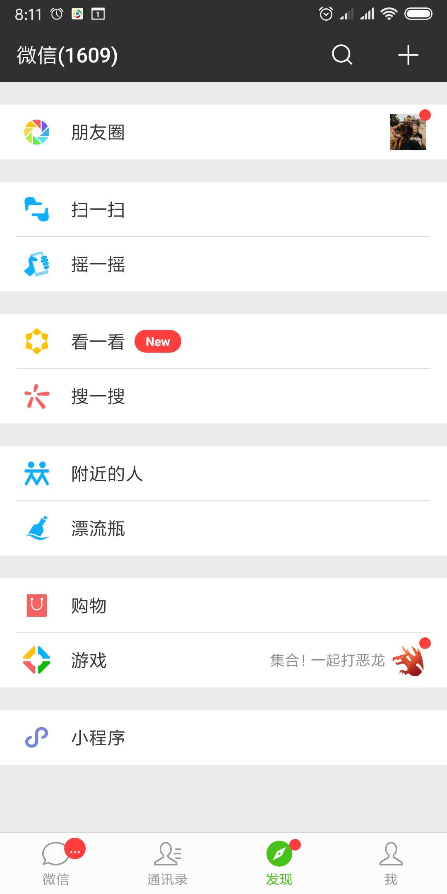
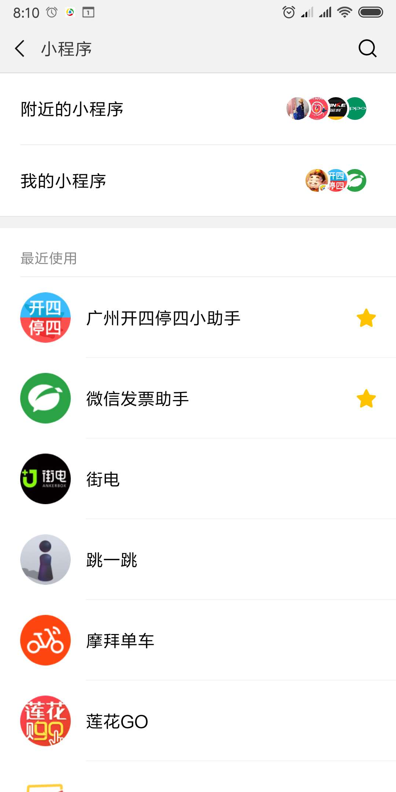
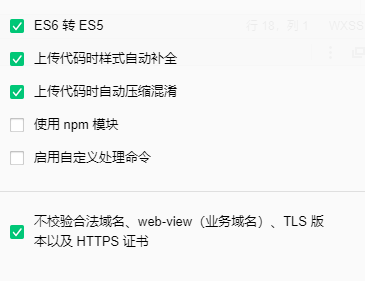

# 微信小程序

微信小程序，简称小程序，是一种不需要下载安装即可使用的应用，它实现了应用“触手可及”的梦想，用户无需安装卸载，只需要扫一扫或搜一下即可打开应用，体现了“用完即走”的理念。

* 可申请小程序的主体类型：企业、政府、媒体、其他组织或个人的开发者
* 2016年9月21日微信小程序正式开启内测
* 2017年1月9日0时正式上线

官网：https://mp.weixin.qq.com/

## 优势

* 入口浅：不用安装，即开即用，用完就走，节省安装时间，不占用桌面
* 体验好：对于用户来说，相较于各种APP，微信小程序UI和操作流程会更统一。这也会降低用户的使用难度
* 成本低：相较于原生APP，开发成本更低，推广更容易更简单，让企业节省大量资金、时间、人力，从而做好自己的产品。
* 更快速：体积小（要求不大于2m），可瞬时打开小程序，更省流量

## 所需技术

* html+css+js
* es6
* vue
* react

## 准备工作

* 注册与资料审核
* 下载微信开发者工具
* 配置小程序基本信息
* 获取小程序appid(小程序开发必备)
* 配置小程序合法域名
    * 必须为https协议

## 微信开发者工具勾选项

## 项目上线流程

1. 本地开发
>在微信web开发者工具中进行开发，可编辑和预览

2. 开发版本
>开发者可以通过扫描特定二维码进行真机测试

3. 体验版本
>供开发者和测试人员做上线前的测试工作

4. 提交审核
>提交给微信进行上线审核，大概一个工作日左右完成审核

5. 线上版本
>审核通过后的版本，可通过微信小程序入口进行访问

## 团队开发权限设置
>添加其他开发者

## 微信小程序代码构成

### 文件类型

* `.json`   配置文件
* `.js`     逻辑文件
* `.wxss`   样式文件
* `.wxml`   布局文件
* `.wxs`     针对小程序的一套脚本语言

### 种类

* 全局通用文件
>根目录下

* 页面级别文件
>pages文件夹下

## 微信小程序生命周期

### onLoad(Object query)

页面加载时触发。一个页面只会调用一次，可以在 onLoad 的参数中获取打开当前页面路径中的参数。

### onShow()

页面显示/切入前台时触发。

### onReady()

页面初次渲染完成时触发。一个页面只会调用一次，代表页面已经准备妥当，可以和视图层进行交互。

>注意：对界面内容进行设置的 API 如wx.setNavigationBarTitle，请在onReady之后进行。

### onHide()
页面隐藏/切入后台时触发。 如 navigateTo 或底部 tab 切换到其他页面，小程序切入后台等。

### onUnload()
页面卸载时触发。如redirectTo或navigateBack到其他页面时。

## 项目目录结构

* 配置层
* 视图层
* 逻辑层

## api文档
>详情请查看官网api文档
